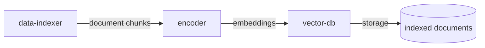
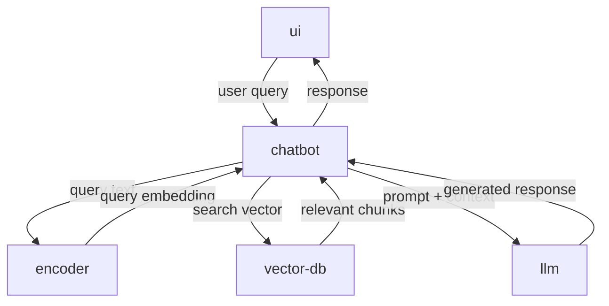

# Workflow

This document describes the interaction workflows between the different components in the RAG chatbot architecture.

## Data Load and Indexing Workflow

This workflow prepares the knowledge base by processing documents and storing them in the vector database for semantic search.

### Steps:

1. **Data Indexer Initialization**
   - The `data-indexer` batch job starts and reads the source documents from the configured location
   - Documents can be in various formats (text, PDF, markdown, etc.)

2. **Document Processing**
   - The `data-indexer` chunks the documents into smaller, semantically meaningful segments
   - Each chunk is sized appropriately to fit within the LLM's context window
   - Metadata is preserved (source file, page numbers, timestamps, etc.)

3. **Embedding Generation**
   - The `data-indexer` sends each chunk to the `encoder` service
   - The `encoder` generates vector embeddings (numerical representations) for each chunk
   - These embeddings capture the semantic meaning of the text

4. **Vector Storage**
   - The `data-indexer` stores the embeddings along with the original text chunks in the `vector-db`
   - The `vector-db` indexes the vectors for efficient similarity search
   - Metadata is stored alongside each vector for retrieval purposes

5. **Completion**
   - The indexing job completes and the knowledge base is ready for queries
   - The system can now respond to user questions based on the indexed documents

---

## Interactive Chat Workflow

This workflow handles real-time user interactions, retrieving relevant context and generating responses.

### Steps:

1. **User Input**
   - User enters a question or message in the `ui` web form
   - The `ui` sends an HTTP POST request to the `chatbot` REST API endpoint

2. **Query Reception**
   - The `chatbot` backend receives the user's message
   - The message is preprocessed and prepared for context retrieval

3. **Semantic Search**
   - The `chatbot` sends the user's query to the `encoder` to generate a query embedding
   - The `encoder` returns the vector representation of the user's question
   - The `chatbot` sends the query embedding to the `vector-db`
   - The `vector-db` performs similarity search to find the most relevant document chunks
   - Top K most similar chunks are returned (typically 3-5 chunks)

4. **Context-Aware Generation**
   - The `chatbot` constructs a prompt combining:
     - The user's original question
     - The retrieved context from relevant document chunks
     - System instructions for the LLM
   - The complete prompt is sent to the `llm` service

5. **Response Generation**
   - The `llm` processes the prompt with the retrieved context
   - The `llm` generates a contextually relevant answer based on the provided information
   - The generated response is returned to the `chatbot`

6. **Response Display**
   - The `chatbot` sends the response back to the `ui` via HTTP
   - The `ui` displays the answer to the user in the web interface
   - User can continue the conversation with follow-up questions

---

## Component Interaction Summary

### Data Indexing Flow

### Chat Interaction Flow

### Key Points:

- The **data-indexer** runs as a batch job (usually once or periodically)
- The **chatbot**, **ui**, **encoder**, and **llm** services run continuously to handle user requests
- The **encoder** is a specialized small language model dedicated to generating embeddings efficiently
- The **vector-db** serves both workflows: write-heavy during indexing, read-heavy during chat
- The **encoder** is used in both workflows: for indexing document chunks and for encoding user queries
- The **llm** is used only for response generation, not for embeddings
- The architecture follows the Retrieval-Augmented Generation (RAG) pattern to provide accurate, context-based responses

